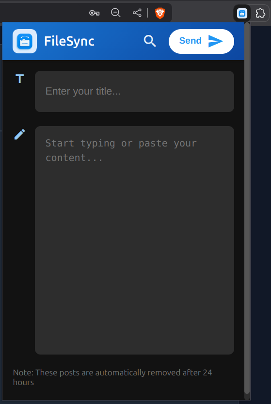
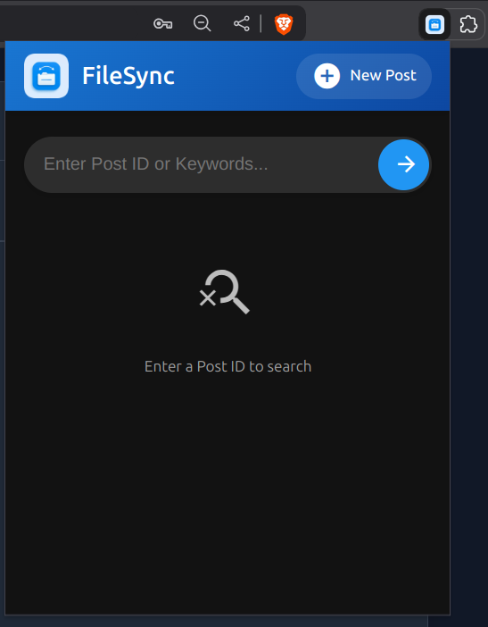

# 🚀 FileSync Chrome Extension  

A **lightweight Chrome extension** that enables users to **post and search public posts** without requiring access to private data.

## 📌 Features  

✅ **Post Public Content** – Users can create and publish public posts.  
✅ **Search Public Posts** – Allows searching for publicly available posts.  
✅ **Minimal Permissions** – No access to private data, ensuring user privacy.  
✅ **Simple UI** – Easy-to-use interface for posting and searching content.  

## 🛠️ Tech Stack  

- **Manifest Version:** MV3  
- **Frontend:** HTML, CSS, JavaScript  
- **Backend:** Spring boot (for storing & retrieving posts)  

## images:
### Add new post:

### Search post:

